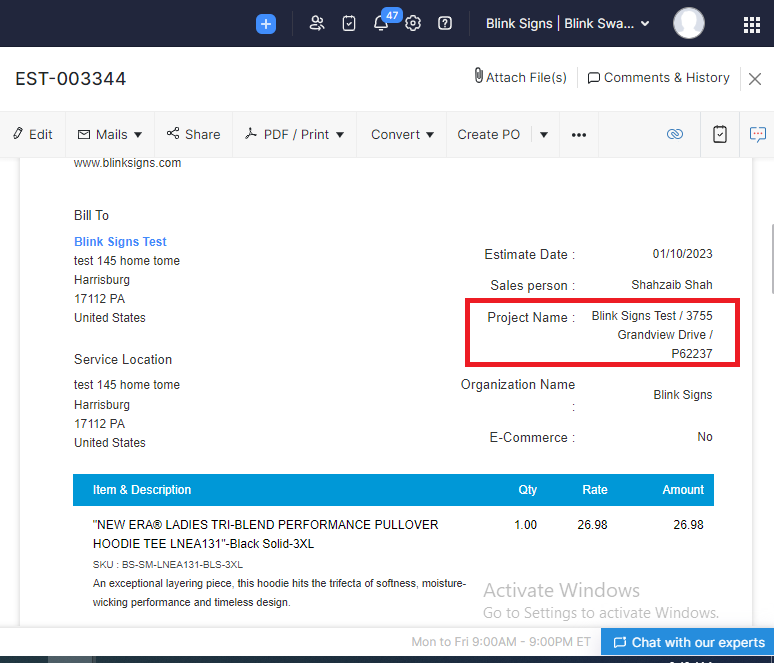
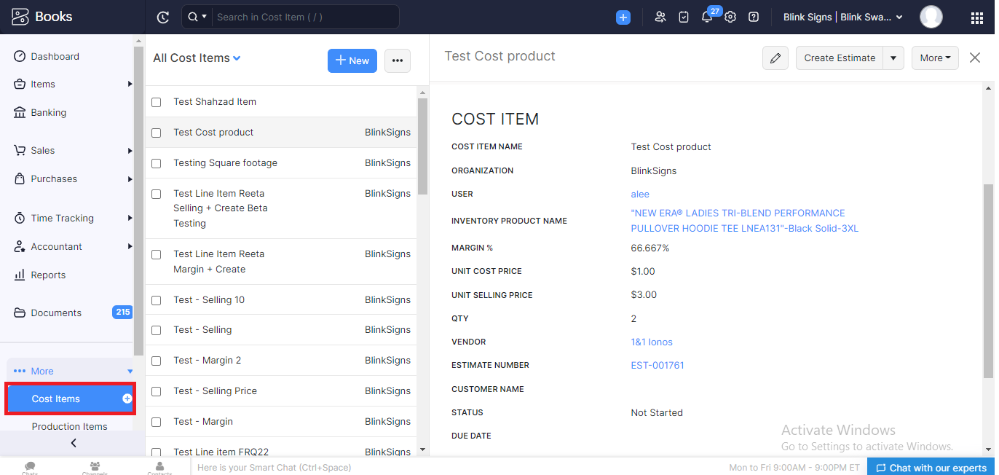

Zoho Books
==========

.. _estimates:

Estimates
---------

- **Convert Estimate to Sales Order**  (11 Jan 2023)

  +------------------------+---------------+-----------+-------------+----------------+----------+
  |        Zoho App        |  Module Name  | On Button | On Workflow |  On Scheduler  |  Status  |
  +========================+===============+===========+=============+================+==========+
  | Zoho Books             |    Estimate   |    Yes    |      No     |       No       |   Live   |
  +------------------------+---------------+-----------+-------------+----------------+----------+

**Steps:**

#.  Check if estimate contains the Zoho Project.

    
#.  Creating a Map(JSON) of all custom fields to compare it with estimate custom fields in next step. Also add project id into Map.
#.  Fetching Sales Order custom fields to compare it with above created Map of Estimate custom fields with following conditions.

    * Check if both fields are active.
    * Data type of fields are same.
    * Label of both fields are same.

#.  If project id was not null add project into salesorder.
#.  Check discount type. If type is entity_level and a discount at entity level or if its on item level add it on item level.
#.  Check if salesperson is not empty field else add it into Sales Order.
#.  Check if contact persons is not empty field add it into Sales Order.
#.  Add all custom fields in Sales Order which were campared in step 3.
#.  Get all line items detials from estimate and create a JSON map for Sales Order creation. 
#.  Also add Project id into Line Items.
#.  Get all line items detials from 
#.  In this function we are creating Sales Order when estimate is accepted.

Sales Orders
------------

- **Convert Sales Order to Purchase Order**

  +------------------------+---------------+-----------+-------------+----------------+---------+
  |        Zoho App        |  Module Name  | On Button | On Workflow |  On Scheduler  |  Status |
  +========================+===============+===========+=============+================+=========+
  | Zoho Books             |  Sales Order  |    Yes    |      No     |       No       |   Live  |
  +------------------------+---------------+-----------+-------------+----------------+---------+

- **Update SO Details on Zoho Project**

  +------------------------+---------------+-----------+-------------+----------------+---------+
  |        Zoho App        |  Module Name  | On Button | On Workflow |  On Scheduler  |  Status |
  +========================+===============+===========+=============+================+=========+
  | Zoho Books             |  Sales Order  |     No    |     Yes     |       No       |   Live  |
  +------------------------+---------------+-----------+-------------+----------------+---------+

  **Steps:**
  
  #.  Search all ``cost items(custom module)`` by using estimate line items.
  

  
  
2.  List the vendors from cost items and remove duplicates s.
3.  Get all cost items against vendors and create a PO.
4.  Create a PO.
5.  Update PO number on Estimate
  
To retrieve a list of random ingredients,
you can use the ``lumache.get_random_ingredients()`` function:

.. autofunction:: lumache.get_random_ingredients

The ``kind`` parameter should be either ``"meat"``, ``"fish"``,
or ``"veggies"``. Otherwise, :py:func:`lumache.get_random_ingredients`
will raise an exception.

.. autoexception:: lumache.InvalidKindError

For example:

>>> import lumache
>>> lumache.get_random_ingredients()
['shells', 'gorgonzola', 'parsley']
