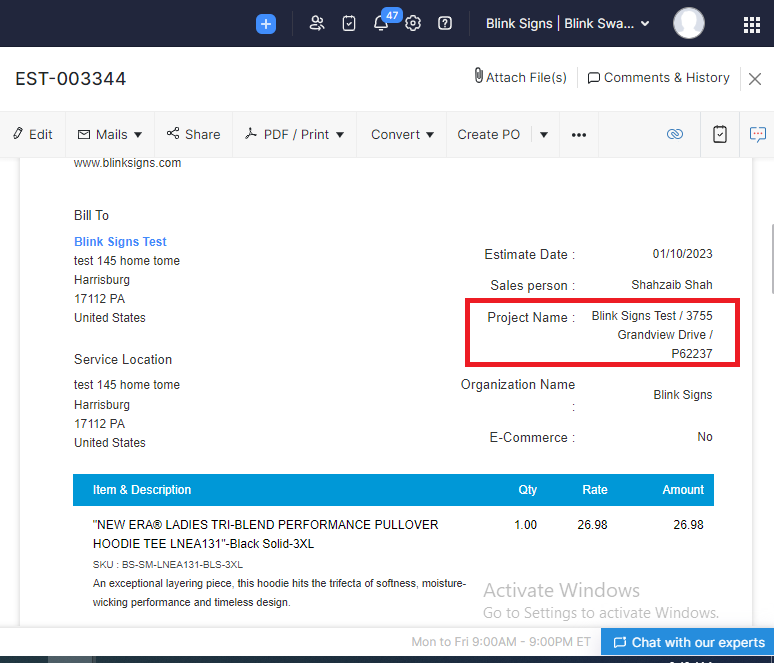
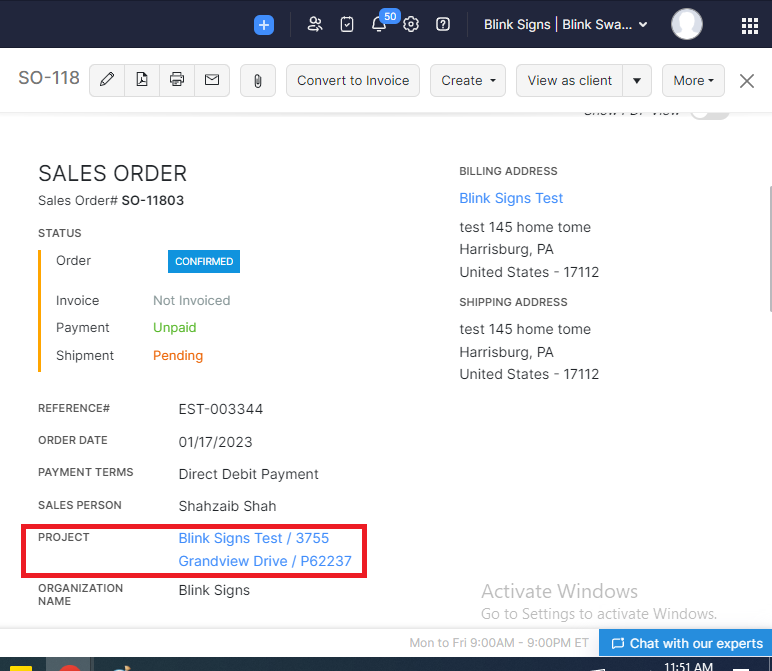
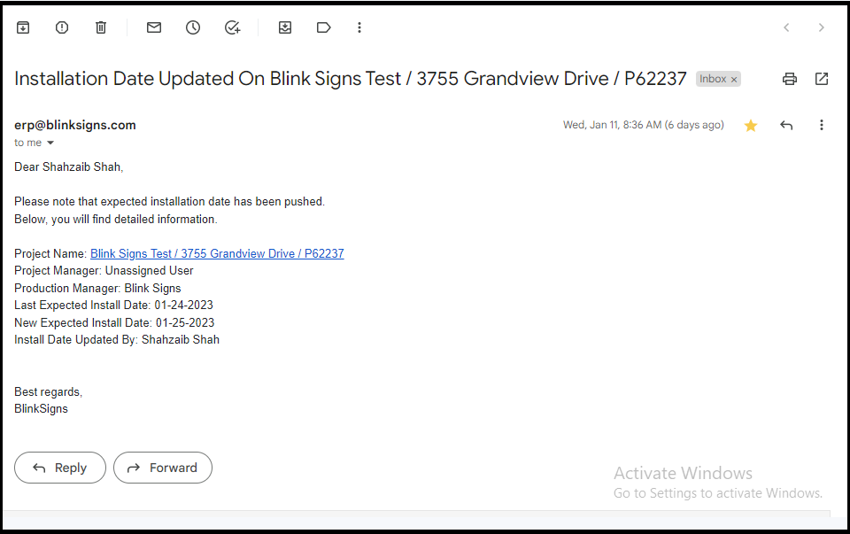

Zoho Books
==========

.. _estimates:

Estimates
---------                                                                                                        																							

- **Convert Estimate to Sales Order**  (11 Jan 2023)

  +------------------------+---------------+-----------+-------------+----------------+----------+
  |        Zoho App        |  Module Name  | On Button | On Workflow |  On Scheduler  |  Status  |
  +========================+===============+===========+=============+================+==========+
  | Zoho Books             |    Estimate   |    Yes    |      No     |       No       |   Live   |
  +------------------------+---------------+-----------+-------------+----------------+----------+

**Steps:**

#.  Check if estimate contains the Zoho Project.

    
2.  Create a Map(JSON) of all custom fields to compare it with Sales Order custom fields in next step. Also add project id into Map.
#.  Fetch Sales Order custom fields to compare it with above created Map of Estimate custom fields against following conditions.

    * Check if both fields are active.
    * Data type of fields are same.
    * Label of both fields are same.

#.  If project id was not null add it into the custom fields Map.
#.  Add Discount by checking discount type. It may be on item level or entity level.
#.  Add sales person into Sales Order.
#.  Add contact persons into Sales Order.
#.  Add all custom fields in Sales Order which were campared in step 3 along with Project id.
#.  Create a Sales Order.

#.  Submit Sales Order for approval.

..  code-block:: php
 
	  url :"https://books.zoho.com/api/v3/salesorders/" + salesorder_id + "/submit"

11. Approve the Sales Order.

..  code-block:: php
  
	  url :"https://books.zoho.com/api/v3/salesorders/" + salesorder_id + "/approve"

12.  Mark Sales Order as Confiremd/Open.

..  code-block:: php
  
	  url :"https://books.zoho.com/api/v3/salesorders/" + salesorder_id + "//status/open"

13.  Update the following fields on Zoho Project.

     * Update Sales Order Number on Zoho Project.
     * Status of Salesorder will be updated as Zoho Project Status & Substatus.
|
- **Update Cost Items**

  +------------------------+---------------+-----------+-------------+----------------+------------+
  |        Zoho App        |  Module Name  | On Button | On Workflow |  On Scheduler  |   Status   |
  +========================+===============+===========+=============+================+============+
  | Zoho Books             |  Sales Order  |    Yes    |     Yes     |       No       |   Pending  |
  +------------------------+---------------+-----------+-------------+----------------+------------+
|
|
Sales Orders
------------

- **Update SO Data on Zoho Project (Status & Installation Date)**

  +------------------------+---------------+-----------+-------------+----------------+---------+
  |        Zoho App        |  Module Name  | On Button | On Workflow |  On Scheduler  |  Status |
  +========================+===============+===========+=============+================+=========+
  | Zoho Books             |  Sales Order  |     No    |     Yes     |       No       |   Live  |
  +------------------------+---------------+-----------+-------------+----------------+---------+
**Steps:**

#.  Check if Sales Order contains the Zoho Project.

    
2.  Push the following fields on Zoho Project.

    * Expected Install Date.
    * Project Managers.
    * Production Managers.

3.  Update Sales Order Number on Zoho Project.
#.  Update the status on Zoho Project as it is on Sales Order as under:

+---------------------------------+------------------------+---------------------------+
|        Sales Order Status       |  Zoho Project Status   |  Zoho Project Sub Status  |                
+=================================+========================+===========================+
|               Open              |        Approved        |          Approved         |
+---------------------------------+------------------------+---------------------------+
|               Void              |        Declined        |          Declined         |
+---------------------------------+------------------------+---------------------------+
|            Production           |        Production      |          Production       |
+---------------------------------+------------------------+---------------------------+
|          Order Material         |        Production      |          Production       |
+---------------------------------+------------------------+---------------------------+
|             Permitting          |         Permit         |          Permit           |
+---------------------------------+------------------------+---------------------------+
|             Installing          |      Installation      |        Installation       |
+---------------------------------+------------------------+---------------------------+
|      Waiting for Fulfilment     |       Order Setup      |         Order Setup       |
+---------------------------------+------------------------+---------------------------+
|          Being Fulfiled         |       Order Setup      |         Order Setup       |
+---------------------------------+------------------------+---------------------------+
|              Service            |         Service        |          Service          |
+---------------------------------+------------------------+---------------------------+
|              Survey             |         Survey         |          Survey           |
+---------------------------------+------------------------+---------------------------+

5.  If Zoho Project does not contains Expected Installation Date, pull it form Sales Order.
#.  If Zoho Project contains Expected Installation Date, and if it is different from Sales Order:

    * Push new Expected Installation date from Sales Order Zoho Project.
    * Send an email to Brittani Shipek & Sharjeel Farooq.

|    
- **Convert Sales Order to Purchase Order**

  +------------------------+---------------+-----------+-------------+----------------+------------+
  |        Zoho App        |  Module Name  | On Button | On Workflow |  On Scheduler  |    Status  |
  +========================+===============+===========+=============+================+============+
  | Zoho Books             |  Sales Order  |     No    |     Yes     |       No       |   Pending  |
  +------------------------+---------------+-----------+-------------+----------------+------------+

  

